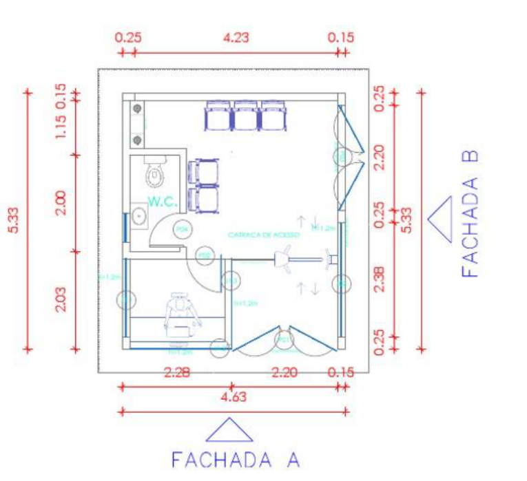
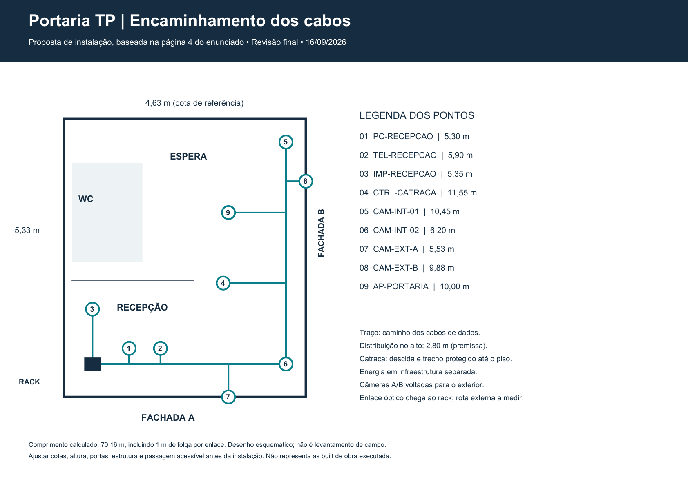
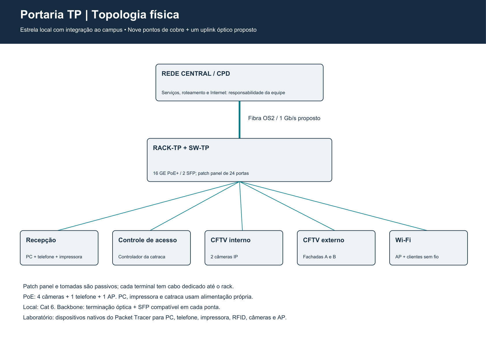
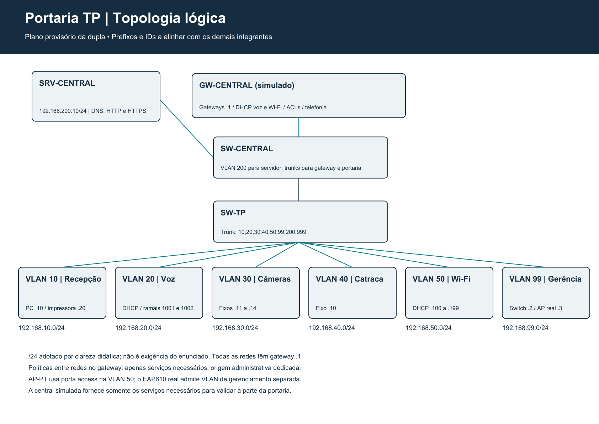

# Projeto de infraestrutura de redes

## Portaria TP — Terminal Portuário

**UNDB — Escola de Tecnologia**

Disciplina: UNDB 4.0 Infraestrutura de Redes — 2026.2

Professor: Arlley Costa

**Taino Samuel Lima Ribeiro**

**Victor Eduard Rodrigues Cabral**

São Luís — MA | 16 de setembro de 2026

**Problema 1 — Desafios para conectividade empresarial**

Escopo desta parte: infraestrutura da Portaria TP e interface com o núcleo compartilhado do terminal. A equipe desenvolverá o conjunto do complexo; esta dupla responde inicialmente pela portaria.

**Natureza da entrega:** proposta acadêmica de projeto, com dimensionamento por premissas. Não representa levantamento de campo ou obra executada. As verificações executadas na simulação constam em 05-Validacao.

<!-- pagebreak -->

## Resumo executivo

A Portaria TP concentra recepção, comunicação telefônica, impressão, controle de acesso e vigilância. Propõe-se uma rede local em estrela com nove conexões de cobre, um access point e integração óptica ao núcleo do terminal. Um switch gerenciável fornece conectividade e alimentação aos equipamentos PoE compatíveis; o cabeamento é identificado e concentrado em rack protegido.

O projeto organiza dados, voz, vídeo, controle de acesso, Wi-Fi e gerenciamento em segmentos lógicos distintos. A comunicação entre segmentos deve obedecer a regras de acesso no gateway central. O objetivo é sustentar a operação da recepção e reduzir o impacto de falhas de energia, acesso indevido e manutenção desorganizada.

O cenário físico proposto resulta em **70,16 m de cabo horizontal instalado**, incluindo trechos verticais e folgas. A necessidade com reserva de aquisição de 20% é **84,19 m**, arredondada para 85 m. O orçamento considera uma caixa comercial de 305 m, cujo saldo poderá ser usado nas demais áreas da equipe.

O escopo local da portaria é estimado em **R$ 29.347,83**, incluindo infraestrutura, terminais, serviços e contingência de 15%. O enlace compartilhado de 100 m em duto existente forma um cenário separado de **R$ 3.634,00** com contingência. A soma dos dois cenários é **R$ 32.981,83**. Os valores são de ordem de grandeza: ofertas consultadas e provisões de engenharia aparecem separadas.

## 1. Escopo e metodologia

O enunciado descreve a expansão de um terminal logístico. Na página 4, a portaria funciona como recepção e possui uma estação com telefone, impressora, catraca e quatro câmeras. Na página 3, exige-se também acesso Wi-Fi nas áreas. A página 6 define os seis entregáveis usados para estruturar este relatório.

A metodologia parte da operação para chegar aos equipamentos: identificar os serviços necessários; levantar requisitos e riscos; definir endereçamento e fluxos; distribuir pontos e encaminhamentos; dimensionar portas, energia e materiais; estimar o investimento; montar o laboratório; verificar e documentar os resultados.

### 1.1 Alternativas consideradas

- Rede única com todos os dispositivos: simples de montar, porém mistura serviços e dificulta aplicar restrições por função.
- Rede segmentada, com serviços no núcleo: solução escolhida. Mantém a portaria compacta e permite que a equipe compartilhe telefonia, gestão e armazenamento.
- Portaria totalmente autônoma, com servidores e gravação locais: reduz algumas dependências, mas duplica recursos e amplia manutenção/custo. Não foi adotada como base.

### 1.2 Premissas que a equipe deve validar

- O núcleo fornecerá roteamento, políticas de acesso e integração dos serviços. Não há definição central existente informada pela equipe.
- Endereços e VLANs deste relatório são uma proposta provisória; conflitos serão resolvidos antes da integração.
- Pé-direito de referência: 2,80 m; concentração dos cabos no rack a 1,50 m; alturas dos pontos conforme a memória de cálculo.
- Um AP atende inicialmente até dez clientes autorizados simultâneos; é uma hipótese de capacidade, não uma quantidade dada pelo professor.
- O enlace externo de 100 m é somente cenário financeiro. O comprimento real será levantado pela equipe.
- Meta de continuidade elétrica: ao menos 15 minutos para a rede e controle, a verificar pela curva do nobreak e teste de carga.
- Não há teto de investimento de rede informado. O valor de R$ 2,5 bilhões do enunciado se refere ao empreendimento logístico inteiro.

## 2. Requisitos e critérios de atendimento

| ID | Requisito e origem | Atendimento proposto | Evidência necessária |
|---|---|---|---|
| R01 | PC e telefone — enunciado p. 4 | Duas tomadas na mesa, segmentos de dados e voz | Endereçamento e comunicação; chamada quando configurada |
| R02 | Impressora — enunciado p. 4 | Impressora Ethernet ligada ao switch | Conectividade e impressão em instalação real |
| R03 | Catraca — enunciado p. 4 | Controlador Ethernet com energia própria | Conexão ao sistema e ensaio de operação real |
| R04 | Duas câmeras internas — enunciado p. 4 | CFTV IP em recepção e circulação | Conectividade; enquadramento/gravação na implantação |
| R05 | Câmeras A e B — enunciado p. 4 | Uma câmera por fachada, com conexão protegida | Posição e conectividade dos dois pontos |
| R06 | Wi-Fi — enunciado p. 3 | Um AP cabeado, SSID corporativo | Associação e acesso autorizado |
| R07 | Materiais e metragem — enunciado p. 3/6 | Lista, caminhos, comprimentos e orçamento | Consistência entre pontos, portas e custos |
| R08 | Segurança e continuidade — necessidade do negócio | Segmentação, controle de acesso e nobreak | Testes positivos/negativos e procedimento de contingência |

### 2.1 Relação de pontos

O mapa abaixo associa os pontos físicos ao laboratório. No switch comercial, reservar as portas 1 a 9; Fa0/x é a nomenclatura do switch Cisco 3560 usado no Packet Tracer. O gerenciamento do switch não consome uma porta física adicional.

| Ponto | Identificação | Porta PT | VLAN | Endereço proposto |
|---|---|---|---|---|
| PT-01 | PC-RECEPCAO | Fa0/1 | 10 | 192.168.10.10 |
| PT-02 | TEL-RECEPCAO | Fa0/2 | 20 | DHCP .20.100+ |
| PT-03 | IMP-RECEPCAO | Fa0/3 | 10 | 192.168.10.20 |
| PT-04 | CTRL-CATRACA | Fa0/4 | 40 | 192.168.40.10 |
| PT-05 | CAM-INT-01 | Fa0/5 | 30 | 192.168.30.11 |
| PT-06 | CAM-INT-02 | Fa0/6 | 30 | 192.168.30.12 |
| PT-07 | CAM-EXT-A | Fa0/7 | 30 | 192.168.30.13 |
| PT-08 | CAM-EXT-B | Fa0/8 | 30 | 192.168.30.14 |
| PT-09 | AP-PORTARIA | Fa0/9 | 50 | AP-PT sem IP; real: 192.168.99.3 |

As quatro câmeras, o telefone e o AP são candidatos à alimentação PoE. PC, impressora e catraca têm alimentação própria. O telefone comercial será SIP; eventual telefone Cisco do laboratório demonstra a função de voz e não certifica interoperabilidade de fabricantes.

## 3. Riscos e justificativa do investimento

| Risco | Efeito na portaria | Tratamento proposto | Limite residual |
|---|---|---|---|
| Falta de energia | Parada da recepção e vigilância | Nobreak e alimentação dos ativos essenciais | Autonomia finita; testar com carga real |
| Switch ou enlace indisponível | Perda de acesso aos serviços centrais | Identificação, reposição e procedimento de contingência | Um switch e um enlace são pontos únicos de falha |
| Acesso indevido entre serviços | Alteração de ativos ou exposição de imagens | VLANs e regras no gateway; gerência restrita | Exige também controle de credenciais e dos próprios sistemas |
| Chuva, calor, poeira e maresia | Degradação de câmeras e conexões | Vedação, posição protegida e inspeção periódica | Confirmar adequação ambiental; IP não comprova resistência salina |
| Cabo mal instalado | Falhas intermitentes e demora de reparo | Canalização, identificação e testes | Certificação física não é reproduzida pelo simulador |
| Ausência de gravação central | Falta de histórico de ocorrências | Definir retenção e responsável pelo armazenamento | Rede da portaria não substitui NVR/VMS |
| Incompatibilidade com o núcleo | Falha na integração das áreas | Contrato de interface: VLAN, IP, fibra e serviços | Depende de alinhamento da equipe |

O investimento é justificado pela continuidade da entrada de pessoas, comunicação da recepção e disponibilidade das informações de segurança. O projeto não apresenta retorno financeiro ou disponibilidade percentual sem dados que permitam calculá-los. Para falha de rede, prever operação local do controle conforme o produto e procedimento humano definido pelo responsável operacional.

## 4. Projeto físico e cabeamento

### 4.1 Distribuição no ambiente

A planta do enunciado mostra a fachada A na parte inferior e a fachada B à direita. A recepção ocupa a parte inferior esquerda e o sanitário, parte da lateral esquerda. As cotas de referência são 4,63 m por 5,33 m, aproximadamente 24,68 m²; o desenho deve ser conferido antes da instalação.

O rack é proposto em posição protegida na recepção, fora do alcance do público e com manutenção possível. O desenho esquemático indica sua projeção; não fixa furação ou altura final. Evitar tubulações hidráulicas e o interior do sanitário. Câmeras internas observam a recepção e a circulação; não filmam o interior do WC.

O tronco dos cabos passa pelo alto da recepção e segue pela lateral direita, derivando para os pontos. Cada enlace volta individualmente ao patch panel. As linhas coincidentes representam cabos no mesmo encaminhamento, não ligações em série entre terminais. Catraca: descida protegida junto à lateral e derivação pelo piso, com percurso equivalente ao traçado em planta. Não deixar cabos soltos na circulação.

O guia da iDBlock Next exige preparação de energia e dados separada. A catraca recebe um enlace Ethernet externo; seus componentes internos se interligam no próprio equipamento [S4–S5]. A preparação civil da passagem, área de giro, circulação acessível e rota de saída devem ser compatibilizadas com o projeto do edifício.

### 4.2 Memória de cálculo

Para cada enlace: comprimento = percurso em planta + subida do rack ao alto (1,30 m) + descida ao ponto + 1 m de folga técnica. Alturas: mesa/impressora 0,80 m; câmeras internas 2,60 m; externas e AP 2,80 m. No ponto da catraca, a descida é contabilizada até o piso.

| Ponto | Destino | Porta | VLAN | Planta (m) | Vertical (m) | Folga (m) | Total (m) |
|---|---|---|---|---|---|---|---|
| PT-01 | PC-RECEPCAO | Fa0/1 | 10 | 1,00 | 3,30 | 1,00 | 5,30 |
| PT-02 | TEL-RECEPCAO | Fa0/2 | 20 | 1,60 | 3,30 | 1,00 | 5,90 |
| PT-03 | IMP-RECEPCAO | Fa0/3 | 10 | 1,05 | 3,30 | 1,00 | 5,35 |
| PT-04 | CTRL-CATRACA | Fa0/4 | 40 | 6,45 | 4,10 | 1,00 | 11,55 |
| PT-05 | CAM-INT-01 | Fa0/5 | 30 | 7,95 | 1,50 | 1,00 | 10,45 |
| PT-06 | CAM-INT-02 | Fa0/6 | 30 | 3,70 | 1,50 | 1,00 | 6,20 |
| PT-07 | CAM-EXT-A | Fa0/7 | 30 | 3,23 | 1,30 | 1,00 | 5,53 |
| PT-08 | CAM-EXT-B | Fa0/8 | 30 | 7,58 | 1,30 | 1,00 | 9,88 |
| PT-09 | AP-PORTARIA | Fa0/9 | 50 | 7,70 | 1,30 | 1,00 | 10,00 |

**Total instalado estimado: 70,16 m.** Com 20% de reserva: 84,19 m, arredondados a 85 m. Patch cords são adicionais: nove de 1 m no rack e nove de 2 m junto aos pontos, totalizando 27 m. Adaptar a terminação de AP/câmeras à montagem e à proteção dos conectores.

O orçamento compra uma caixa de 305 m. Há saldo de 220 m após reservar 85 m para a portaria; esse saldo é material da equipe e não deve ser novamente cobrado como outra caixa consumida pela portaria. A reserva não é cabo instalado. Os 25 m de canalização do orçamento são uma provisão inicial para trechos compartilhados, descidas e acessórios, sujeita ao detalhamento civil.

### 4.3 Materiais e instalação

Adotar cabo Cat 6 de cobre, tomadas e patch panel da mesma categoria, sem reduzir a categoria nos cordões. Identificar ambas as extremidades: RACK-TP/PP01/01 ↔ PT-01, repetindo a numeração até 09. Manter diagrama de portas junto ao rack e adotar a mesma pinagem nas duas pontas conforme o sistema escolhido.

Terminações externas ficam protegidas da água e radiação solar. Cabo interno não deve ficar exposto à intempérie: a solução assume passagem pelo interior até uma caixa protegida na fachada. Trechos que exigirem exposição precisam de cabo e acessórios apropriados, revisando o quantitativo.

A aula de cabeamento aborda rack, patch panel, backbone e limite de 90 m para o enlace horizontal. Os enlaces projetados são muito menores; a implantação ainda exige verificação de continuidade, pares, categoria e desempenho. Os diagramas físicos não comprovam certificação.

### 4.4 Organização do rack e energia

Propor rack 19 pol, 8 U, com profundidade útil mínima de 450 mm: terminação óptica (1 U), patch panel (1 U), organizador (1 U), switch (1 U), bandeja/organização (1 U), mantendo reserva. Conferir dimensões reais e raio de curvatura. O nobreak em torre fica em apoio protegido e ventilado, não suspenso em uma bandeja sem capacidade comprovada.

O switch selecionado dispõe de 16 portas PoE+ e dois SFP [S1]. Nove portas de acesso serão usadas; sete permanecem livres. Um SFP liga o núcleo e o outro fica reservado. A quantidade de portas não garante potência suficiente: o limite agregado deve ser conferido.

Para dimensionamento conservador, reservar 15,4 W por dispositivo 802.3af (4 câmeras + telefone) e 30 W para o AP 802.3at: **5 × 15,4 + 30 = 107 W** no lado do switch. Com 25% de margem, **133,75 W**, abaixo do orçamento PoE de 150 W. Essa é reserva por classe, não consumo medido. A expansão também deve respeitar a potência restante.

O nobreak de referência é SMS Tech 1200 VA, fator de potência de saída 0,5 (600 W), saída 115 V [S12]. A seleção fica condicionada à compatibilidade das fontes com sua forma de onda e à curva de autonomia. Estimar até 200 W para rede/controle e seus conversores, com meta de 15 min; confirmar em teste. A impressora laser não integra a carga protegida. Alimentação protegida do computador exigirá incluí-lo no novo cálculo de carga.

## 5. Topologia física dos ativos

O switch conecta os nove terminais; o AP fornece a WLAN. A rede do terminal é um campus sob administração comum. O enlace entre dois prédios não é classificado como WAN apenas por estar ao ar livre.

O backbone proposto utiliza fibra OS2 monomodo dielétrica, com ao menos um par ativo e fibras de reserva, terminação em ambas as pontas e transceptores compatíveis. Referência: TL-SM311LS, 1310 nm, LC duplex [S8]. Confirmar versão, potência óptica, perdas, distância mínima/máxima e compatibilidade do switch do núcleo; velocidade de linha do módulo não representa vazão garantida da aplicação.

A fibra reduz a dependência de cobre entre edificações. Sua instalação e a infraestrutura elétrica precisam de planejamento próprio. O orçamento do enlace é compartilhado; não inclui escavação, novo duto externo, recomposição de pavimento ou switch do núcleo.

## 6. Topologia lógica e serviços

### 6.1 Endereçamento e interface com o núcleo

| VLAN | Serviço | Rede / gateway | Uso |
|---|---|---|---|
| 10 | Recepção | 192.168.10.0/24; .1 | PC .10 e impressora .20, fixos |
| 20 | Voz | 192.168.20.0/24; .1 | DHCP .100–.199; telefonia |
| 30 | CFTV | 192.168.30.0/24; .1 | Câmeras .11–.14, fixos |
| 40 | Controle | 192.168.40.0/24; .1 | Controlador .10, fixo |
| 50 | WLAN autorizada | 192.168.50.0/24; .1 | DHCP .100–.199 |
| 99 | Gerenciamento | 192.168.99.0/24; .1 | SW-TP .2; SW-CENTRAL .254; AP real .3; estação técnica .10 |
| 200 | Serviços centrais | 192.168.200.0/24; .1 | Servidor de laboratório .10 |

Os /24 foram escolhidos para legibilidade didática. O consumo de endereços é pequeno; a equipe poderá adotar blocos menores ou outro plano. Não usar esses prefixos em outras áreas sem coordenação. A máscara é 255.255.255.0. DHCP deve excluir os endereços fixos, gateways e reservas.

O enlace SW-TP–SW-CENTRAL é trunk 802.1Q com as VLANs 10, 20, 30, 40, 50, 99, 200 e 999. A VLAN nativa 999 não atende usuários. No laboratório, o AP-PT usa uma porta de acesso na VLAN 50 e não recebe endereço de gerenciamento. Na implantação, o EAP610 admite VLAN de gerenciamento; a proposta reserva 192.168.99.3 para essa função.

O gateway e o roteamento ficam no núcleo. Para o laboratório independente, o roteador GW-CENTRAL liga-se ao SW-CENTRAL, que concentra o servidor 192.168.200.10, o segundo ramal e o trunk da portaria. Esses equipamentos centrais servem apenas à validação e não constituem novo escopo de compra da dupla.

### 6.2 Serviços e responsabilidades

- DHCP: gateway simulado fornece configuração de voz e WLAN; a rede definitiva poderá centralizar em servidor com relay.
- DNS: servidor central de teste em 192.168.200.10, com nome portal.tp.test. Esse nome é interno do laboratório.
- HTTP: página de teste demonstra acesso ao serviço central; não representa o sistema produtivo de controle ou gravação.
- Telefonia: central fornece registro e chamadas. O laboratório pode usar CME/SCCP com telefone Cisco; o telefone SIP orçado demanda central SIP compatível na implantação.
- CFTV: gravação e consulta devem ser fornecidas por NVR/VMS central, sob responsabilidade da equipe. Conectividade não equivale a gravação.
- Controle: catraca integra o sistema de acesso e pode usar as capacidades locais do produto. Regras de liberação e operação offline dependem da configuração do controlador.
- Gerência: restringir a uma origem administrativa, usar credenciais próprias e SSH onde suportado. Desativar portas não utilizadas e serviços desnecessários.

O enunciado prevê três servidores e um storage no administrativo. As funções acima são uma proposta de utilização compartilhada, não uma atribuição expressa do professor. Não é necessário contratar uma Internet separada para a portaria se o núcleo já oferece esse acesso.

### 6.3 Matriz de comunicação

| Origem | Destino autorizado | Finalidade | Restrição |
|---|---|---|---|
| Recepção | Impressora e sistemas centrais | Impressão e operação | Sem acesso administrativo aos ativos de rede |
| Câmeras | NVR/VMS e serviços técnicos autorizados | Vídeo, horário e gestão | Sem acesso irrestrito à recepção/WLAN |
| Controlador | Servidor de acesso autorizado | Validação e registros | Sem comunicação livre com outros segmentos |
| Voz | Central e ramais autorizados | Sinalização e mídia | Liberar os fluxos da solução de telefonia |
| WLAN | DNS e portal autorizado | Conectividade corporativa | Bloquear acesso aos segmentos de controle e gestão |
| Estação técnica | Ativos administrados | Manutenção autorizada | Demais origens sem acesso de administração |

A separação por VLAN cria domínios distintos, mas o roteamento pode restabelecer a comunicação entre eles. Portanto, as ACLs no gateway devem refletir a matriz [S9]. Os arquivos de configuração do laboratório devem declarar as regras efetivamente implementadas. Na solução real, definir também portas/protocolos de vídeo, controle e voz com os fabricantes; não presumir que todos usam HTTP.

### 6.4 Dimensionamento de vídeo

Premissa de cálculo: quatro câmeras a 4 Mb/s cada, contínuos, 30 dias. A taxa agregada é 16 Mb/s; o volume é 16 × 10⁶ × 86.400 × 30 / 8 = 5,184 × 10¹² bytes, aproximadamente **5,184 TB decimais**. Com 20% de folga, cerca de **6,22 TB úteis**.

São capacidade e banda estimadas, não medição. Codec, FPS, cena e gravação por movimento alteram o consumo. O storage central deve somar as demandas das demais áreas, considerando capacidade útil após redundância e retenção aprovada. A portaria não orça um NVR separado neste cenário; a equipe deve incluí-lo ou reservar capacidade no sistema central.

## 7. Lista de materiais e orçamento por ordem de grandeza

Data-base: 16/09/2026. **Oferta** indica preço público consultado, sujeito a disponibilidade, condição de pagamento e alteração. **Estimativa** indica provisão de engenharia; não é proposta comercial de fornecedor. Frete e tributos adicionais não informados nas ofertas devem ser conferidos. Não foram realizadas compras.

A lista abrange infraestrutura local, terminais, instalação e um cenário de enlace. A planilha CSV em 04-Orcamento mantém grupos, fontes e valores para integração com a equipe. A contingência de 15% é uma escolha de planejamento, não garantia contra toda variação.

| Item | Material / serviço | Qtd. | Unitário | Subtotal | Base | Fonte |
|---|---|---|---|---|---|---|
| 01 | Switch TP-Link TL-SG2218P; 16 GE PoE+ / 2 SFP / 150 W | 1 un | R$ 1.799,98 | R$ 1.799,98 | Oferta | P1 |
| 02 | AP TP-Link EAP610; dual band Wi-Fi 6 / PoE+ | 1 un | R$ 769,99 | R$ 769,99 | Oferta | P2 |
| 03 | Cabo Furukawa SOHOPLUS Cat 6 U/UTP; caixa 305 m | 1 cx | R$ 1.459,99 | R$ 1.459,99 | Oferta | P5 |
| 04 | Patch panel Furukawa SOHOPLUS 35050402; Cat 6 / 24 portas | 1 un | R$ 599,00 | R$ 599,00 | Oferta | P6 |
| 05 | Keystone Furukawa SOHOPLUS Cat 6 | 9 un | R$ 35,00 | R$ 315,00 | Estimativa | E |
| 06 | Patch cord Furukawa Cat 6; 9 de 1 m e 9 de 2 m | 18 un | R$ 35,00 | R$ 630,00 | Estimativa | E |
| 07 | Rack de parede Intelbras 8 U / 19 pol; profundidade útil >= 450 mm | 1 un | R$ 650,00 | R$ 650,00 | Estimativa | E |
| 08 | Organizadores 1 U Intelbras + bandeja + PDU compatível | 1 kit | R$ 260,00 | R$ 260,00 | Estimativa | E |
| 09 | Caixas/espelhos Tigre, nove pontos; externos vedados | 9 un | R$ 25,00 | R$ 225,00 | Estimativa | E |
| 10 | Tigre: canaleta compartimentada/dutos de dados e fixação | 25 m | R$ 25,00 | R$ 625,00 | Estimativa | E |
| 11 | Etiquetas, velcro e consumíveis de terminação | 1 kit | R$ 100,00 | R$ 100,00 | Estimativa | E |
| 12 | Nobreak SMS Tech 1200 VA 29304; saída 115 V | 1 un | R$ 899,99 | R$ 899,99 | Oferta | P7 |
| 13 | Proteções e circuito local: referência Clamper/Tigre | 1 kit | R$ 500,00 | R$ 500,00 | Estimativa | E |
| 14 | PC Lenovo ThinkCentre Neo; 16 GB/SSD 512 GB + monitor 22 pol | 1 kit | R$ 4.000,00 | R$ 4.000,00 | Estimativa | E |
| 15 | Telefone IP Intelbras TIP 125i; versão com PoE | 1 un | R$ 319,90 | R$ 319,90 | Oferta | P4 |
| 16 | Impressora Brother HL-L2460DW; Ethernet 10/100 e duplex | 1 un | R$ 1.600,00 | R$ 1.600,00 | Estimativa | S11 |
| 17 | Câmera Intelbras VIP 1230 B G4; 2 MP / PoE / IR | 4 un | R$ 299,00 | R$ 1.196,00 | Oferta | P3 |
| 18 | Control iD iDBlock Next com um leitor; pacote a confirmar | 1 un | R$ 6.490,00 | R$ 6.490,00 | Estimativa | P8 |
| 19 | Instalação e identificação dos nove pontos | 9 ponto | R$ 120,00 | R$ 1.080,00 | Estimativa | E |
| 20 | Configuração, testes dos cabos e documentação | 1 serv | R$ 1.200,00 | R$ 1.200,00 | Estimativa | E |
| 21 | Instalação da catraca e adequações pontuais do piso | 1 serv | R$ 800,00 | R$ 800,00 | Estimativa | E |
| 22 | Transceptores TP-Link TL-SM311LS compatíveis em ambas pontas | 2 un | R$ 200,00 | R$ 400,00 | Estimativa | S8 |
| 23 | DIO/caixa óptica Furukawa + pigtails/adaptadores LC | 2 kit | R$ 300,00 | R$ 600,00 | Estimativa | E |
| 24 | Cordão LC-LC duplex OS2 Furukawa | 2 un | R$ 80,00 | R$ 160,00 | Estimativa | E |
| 25 | Fibra Furukawa OS2 externa dielétrica 6 fibras; cenário 100 m | 100 m | R$ 6,00 | R$ 600,00 | Estimativa | E |
| 26 | Lançamento em duto existente; cenário 100 m | 100 m | R$ 8,00 | R$ 800,00 | Estimativa | E |
| 27 | Fusões, identificação e teste óptico das duas pontas | 1 serv | R$ 600,00 | R$ 600,00 | Estimativa | E |

### 7.1 Consolidação

| Parcela | Valor | Abrangência |
|---|---|---|
| Infraestrutura local | R$ 8.833,95 | Ativos, cobre, organização e energia |
| Terminais | R$ 13.605,90 | PC, telefone, impressora, câmeras e catraca |
| Serviços locais | R$ 3.080,00 | Montagem, configuração, testes e instalação |
| Enlace compartilhado | R$ 3.160,00 | Cenário de 100 m em duto existente |
| Escopo local direto | R$ 25.519,85 | Rede local, terminais e serviços locais |
| Contingência local de 15% | R$ 3.827,98 | Reserva sobre o escopo local |
| Total local da portaria | R$ 29.347,83 | Orçamento principal da dupla |
| Enlace compartilhado direto | R$ 3.160,00 | Cenário de 100 m em duto existente |
| Contingência do enlace de 15% | R$ 474,00 | Reserva do cenário compartilhado |
| Total do enlace compartilhado | R$ 3.634,00 | Parcela a integrar ao orçamento da equipe |
| Total combinado | R$ 32.981,83 | Soma dos dois cenários, sem dupla contagem |

O enlace é parametrizável: **R$ 1.760,00 + R$ 14,00 × L**, em que L é o comprimento em metros, antes de contingência e sob hipótese de duto existente. Em L = 100 m, resulta em R$ 3.160,00. Essa fórmula inclui duas terminações, transceptores, cordões, lançamento e teste nas condições descritas; não substitui cotação de obra civil.

O pacote da catraca tem preço provisionado com referência comercial, mas o conjunto exato de leitor, software, acabamento e fixação precisa ser confirmado. Itens genéricos de instalação indicam marca de referência e especificação funcional; o código de compra deve ser fechado após a compatibilização física.

Custos centrais não incluídos: roteador/firewall e switch do núcleo, capacidade de storage/NVR/VMS, central SIP e licenças, Internet e obras externas. Esses itens pertencem ao projeto do complexo e precisam aparecer no orçamento geral. Se PC, impressora ou outros terminais já forem fornecidos, retirar sua parcela explicitamente, sem apagar o requisito técnico.

## 8. Plano de implementação e validação

A implantação começa pela compatibilização com o núcleo; segue com infraestrutura elétrica e de dados, montagem dos ativos, identificação dos pontos, configuração e testes. O desenho de encaminhamento atende ao item chamado As built pelo enunciado; após a obra, deverá ser atualizado para mostrar a instalação efetivamente realizada.

No Packet Tracer foram usados dispositivos nativos para PC, telefone IP, impressora, leitor RFID, quatro webcams IoT, AP e cliente Wi-Fi. A parte central contém roteador, switch, servidor e segundo telefone para permitir DHCP, DNS, HTTP/HTTPS e telefonia. O laboratório representa a lógica da solução e não certifica materiais ou desempenho físico [S10].

### 8.1 Critérios de teste

| Teste | Procedimento | Resultado esperado | Limite da evidência |
|---|---|---|---|
| T01 | Conferir inventário e links | Nove pontos locais presentes | Não comprova instalação física |
| T02 | Verificar VLANs e trunk | Portas e VLANs conforme mapa | Conferir configuração e estado operacional |
| T03 | PC alcançar impressora | ICMP responde quando habilitado | Não demonstra impressão real |
| T04 | Cliente WLAN obter IP e acessar portal | Associação, DHCP, DNS/HTTP funcionam | Não mede cobertura ou capacidade real |
| T05 | Origem WLAN acessar gerência/catraca | Comunicação proibida bloqueada | Testar protocolo relevante; ping isolado não basta |
| T06 | Câmeras/controlador alcançar central | Conectividade conforme política | Não demonstra vídeo ou liberação mecânica |
| T07 | Telefonia registrar e chamar outro ramal | Chamada estabelecida | Depende da função de voz implementada |
| T08 | Reabrir .pkt salvo | Configurações e topologia preservadas | Não substitui teste em equipamentos reais |
| T09 | Examinar ARP, ICMP e DNS/HTTP em Simulation | Explicar camadas e fluxo | Modelos e protocolos simplificados |
| T10 | Testar cabos, energia e gravação na implantação | Critérios físicos e operacionais atendidos | Fora do alcance do Packet Tracer |

Em 16/09/2026, o arquivo final foi reaberto no Cisco Packet Tracer 9.0.1 sem alerta de incompatibilidade. A auditoria confirmou 15 dispositivos, 13 enlaces, nove pontos locais, VLANs 10/20/30/40/50/99/200/999, três ACLs, DHCP de voz e Wi-Fi, DNS/HTTP/HTTPS, SSID PORTARIA-TP, quatro webcams, leitor RFID e dois ramais. A estrutura lógica e física interna ficou sem bloqueios e a análise de coerência não encontrou contradições. Testes interativos de ping, chamada e associação devem ser demonstrados pela equipe no aplicativo; não são declarados como executados neste relatório.

### 8.2 Roteiro para a apresentação

- Apresentar os requisitos e os nove pontos da portaria, destacando a obrigação de Wi-Fi.
- Explicar a planta: rack, percursos, câmeras nas fachadas e alimentação da catraca.
- Mostrar a separação dos serviços e a conexão à central simulada.
- Demonstrar comunicação permitida e tentativa bloqueada; explicar o alcance de cada teste.
- Apresentar orçamento, premissas de distância e o que a equipe fornece de forma compartilhada.

Para relacionar com as aulas, acompanhar uma consulta ao portal: configuração IP, resolução de nome, descoberta do próximo salto, quadros Ethernet/Wi-Fi, roteamento e protocolos de aplicação/transporte. A UA III usa TCP/IP em quatro camadas. IP, MAC e porta de transporte cumprem funções diferentes; um switch não troca os IPs dos terminais ao encaminhar quadros.

## 9. Conclusão

A solução proposta atende ao inventário da Portaria TP e organiza sua infraestrutura em nove enlaces locais, um AP e conexão ao núcleo. A segmentação e as políticas de acesso acompanham as funções de recepção, vigilância e controle, enquanto cabeamento identificado e alimentação protegida sustentam a manutenção e a continuidade operacional.

O projeto mantém explícitas as decisões ainda dependentes da equipe: endereçamento definitivo, enlace externo, telefonia, gravação, licenças e critérios de continuidade. Essa divisão permite implementar e testar a parte da dupla sem tratar a central simulada como uma definição definitiva do complexo.

## Referências

Materiais disponibilizados pelo professor, consultados em 15/09/2026:

- UNDB. Problema 1 — Desafios para conectividade empresarial. 2026.2. Páginas 3–6.
- COSTA, Arlley. UA I — Projeto de infraestrutura de redes. Páginas 20, 24–35 e 38–41.
- COSTA, Arlley. UA I — Topologias, tipos e meios de comunicação. Páginas 23–27, 34–45 e 53–56.
- COSTA, Arlley. UA I — Fundamentos de redes de computadores. Páginas 37–50.
- COSTA, Arlley. UA II — Principais protocolos da Internet. Páginas 7–11.
- COSTA, Arlley. UA II — Protocolos e modelos. Páginas 4–9 e 29–32.
- COSTA, Arlley. UA III — Modelos em Camadas OSI e TCP. 2026.2. Páginas 8–34.

Fontes técnicas e comerciais externas:

- **[S1]** [TP-Link SG2218P — especificações](https://www.tp-link.com/br/business-networking/omada-switch-poe/sg2218p/v1.20/). Consulta: 16/09/2026.
- **[S2]** [TP-Link EAP610 — especificações](https://www.tp-link.com/br/business-networking/ceiling-mount-ap/eap610/v1/). Consulta: 16/09/2026.
- **[S3]** [Control iD — iDBlock Next](https://www.controlid.com.br/controle-de-acesso/idblock-next/). Consulta: 16/09/2026.
- **[S4]** [Control iD — instalação da catraca](https://www.controlid.com.br/userguide/idblock-next.pdf). Consulta: 16/09/2026.
- **[S5]** [Control iD — um ponto Ethernet externo](https://www.controlid.com.br/docs/access-api-pt/particularidade-dos-produtos/idblock-next/). Consulta: 16/09/2026.
- **[S6]** [Intelbras — TIP 125i, guia 2026](https://backend.intelbras.com/sites/default/files/2026-02/Guia_TIP_120i_E_125i_01-26_site.pdf). Consulta: 16/09/2026.
- **[S7]** [Intelbras — suporte VIP 1230 B G4](https://www.intelbras.com/pt-br/ajuda-download/download/camera-ip-inteligente-da-serie-1000-vip-1230-b-g4). Consulta: 16/09/2026.
- **[S8]** [TP-Link — transceptor TL-SM311LS V4](https://www.tp-link.com/br/business-networking/omada-accessory-module-cable/tl-sm311ls/v4/). Consulta: 16/09/2026.
- **[S9]** [Cisco — roteamento entre VLANs](https://www.cisco.com/c/en/us/support/docs/lan-switching/inter-vlan-routing/41260-189.html). Consulta: 16/09/2026.
- **[S10]** [Cisco — limites da simulação](https://tutorials.ptnetacad.net/help/default/intro.htm). Consulta: 16/09/2026.
- **[S11]** [Brother — interfaces HL-L2460DW](https://support.brother.com/g/s/id/htmldoc/printer/cv_hll2460dw/use/PDF/PDF.pdf). Consulta: 16/09/2026.
- **[S12]** [SMS — Tech 1200 VA](https://www.sms.com.br/produtos/detalhe/nobreaks-ups-1/line-interactive/nobreak-sms-tech-1200-va/). Consulta: 16/09/2026.
- **[P1]** [Processtec — switch, Pix R$ 1.799,98](https://www.processtec.com.br/produto/switch-16-portas-tp-link-tl-sg2218p-16-portas-gigabit-poe-c-2-portas-sfp). Consulta: 16/09/2026.
- **[P2]** [Pichau — AP, Pix R$ 769,99](https://www.pichau.com.br/access-point-tp-link-omada-mesh-ax1800-wi-fi-6-dual-band-branco-eap610). Consulta: 16/09/2026.
- **[P3]** [Magalu/Data2ti — câmera, R$ 299,00](https://www.magazineluiza.com.br/camera-de-seguranca-intelbras-vip-1230-b-g4-com-resolucao-2mp-branco-preto/p/cge240cg36/cj/cagu/). Consulta: 16/09/2026.
- **[P4]** [iByte — telefone, referência à vista R$ 319,90](https://www.ibyte.com.br/telefone-fixo-ip-intelbras-tip-125i/p). Consulta: 16/09/2026.
- **[P5]** [Ion Cabos — caixa 305 m, referência R$ 1.459,99](https://www.ioncabos.com.br/caixa-de-rede-cat6-furukawa-sohoplus-305-metros). Consulta: 16/09/2026.
- **[P6]** [Mercado Livre — painel 35050402, referência R$ 599,00](https://www.mercadolivre.com.br/patch-panel-cat6-t568ab-24p-24-portas-furukawa-soho-plus-35050402/p/MLB27121982). Consulta: 16/09/2026.
- **[P7]** [KaBuM — SMS Tech 29304, Pix R$ 899,99](https://www.kabum.com.br/produto/466280/nobreak-sms-tech-1200va-6-tomadas-entrada-bivolt-e-saida-115v-29304). Consulta: 16/09/2026.
- **[P8]** [ID2Control — referência de catraca Next com 1 leitor, R$ 6.490,00](https://www.id2control.com.br/). Consulta: 16/09/2026.
